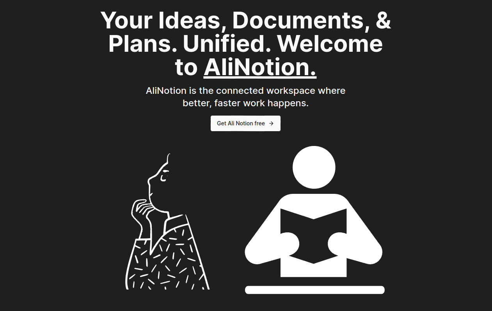

# AliNotion



 <!-- Image in the public folder -->

## Overview

This is a full-stack clone of the popular productivity tool **Notion**, built with Next.js 13. The application replicates core features such as rich text editing, task management, real-time collaboration, and user authentication, providing a seamless and responsive experience. It offers an intuitive interface for managing projects, notes, and tasks, just like the original Notion app.

## Features

- **Rich Text Editing**: Supports rich text features like headings, lists, links, and more using **@blocknote**.
- **Real-Time Collaboration**: Multiple users can interact with the app simultaneously, with changes reflected in real-time.
- **Dynamic Workspaces**: Create and manage customizable workspaces with nested pages.
- **User Authentication**: Secure login and sign-up with **@clerk**.
- **Task Management**: Create, update, and manage tasks and projects with ease.
- **Responsive UI**: Mobile-friendly and sleek design powered by **TailwindCSS**.
- **Serverless Backend**: Backend powered by **Convex** for seamless real-time operations.

## Tech Stack

- **Next.js 14**: Framework for building the React app with built-in SSR (Server-Side Rendering).
- **Convex**: Serverless backend platform for managing real-time data and authentication.
- **@blocknote**: Rich text editor for handling content creation and editing.
- **@clerk**: Authentication service for handling secure logins and user management.

## Installation

To run the project locally, follow these steps:

   ```bash
   git clone https://github.com/ali-sabry/alinotion.git
   cd alinotion
   npm install
   npm run dev
